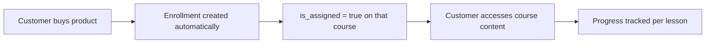

Courses let you deliver structured learning content (video, audio, or text lessons) to customers who have purchased access. Each course is organized into **modules** with **lessons** (contents). Enrollment is tied to a product purchase — when a customer buys the linked product, they are automatically enrolled.

## How courses work



1. You create a course in the ElasticFunnels dashboard with modules and lessons.
2. You link a **product** to that course — purchasing the product grants enrollment.
3. On your course pages, `getCourseForCustomer(slug)` returns `is_assigned: true` for enrolled customers and `false` for everyone else.
4. You gate content in the template: show the full course to enrolled customers, show an "Get access" CTA to others.

## Setting up a course

### 1. Create the course

In the dashboard, go to **Courses** and create a new course. Add:

- **Title**, **slug**, **description**, **cover image**, **instructor name**
- **Category** (optional — used for filtering on the course list page)
- **Modules** — each with a title and one or more **lessons**
- **Lessons** — each has a title, type (`video`, `audio`, or `text`), and a content URL or embed

### 2. Link a product to the course

In the course settings, select the **product** that grants access. When a customer purchases this product, an enrollment record is created automatically.

You can link multiple products to the same course (e.g. a bundle and a standalone SKU both grant access to the same course).

### 3. Create your course pages

You need at minimum two pages:

| Page | Purpose |
|------|---------|
| **Course list** | Show all available courses with enrollment status (assigned vs. not) |
| **Course detail** | Show a single course — full content if enrolled, "Get access" CTA if not |

See [Courses — Template Reference](/courses/template) for complete backend script and template examples.

## Enrollment and `is_assigned`

Enrollment is created automatically by `BrandCourseEnrollment` when a purchase conversion is recorded for a product that is linked to a course.

The `is_assigned` flag is resolved per-customer when you call `getCourseForCustomer(slug)` or `getCourses(false)`. It is `true` if the currently logged-in customer has an enrollment record for the course.

`started` is `true` when the enrollment has any progress (at least one lesson completed or in progress).

<Note>
Customers are automatically logged in after checkout, so a customer who just purchased will have `is_assigned: true` the moment they land on the course page — no extra login step needed.
</Note>

## Progress tracking

Progress is tracked server-side per customer, per lesson. All course functions that resolve enrollment (`getCourseForCustomer`, `getCourses`, `getCoursesForCustomer`) include the customer's progress:

- `completed_content_ids` — array of completed lesson IDs
- `progress_percent` — 0–100

The front-end marks lessons complete by calling the progress API (`POST /api/course/courses/:courseId/lessons/:contentId/complete`).

For dashboards and aggregate views, two additional functions are available:

- `getCompletedLessonsCount(opts?)` — returns the total number of completed lessons (optionally filtered by course slug)
- `getCourseProgress(opts?)` — returns a structured summary with per-course and overall lesson counts

See [Template Reference](/courses/template) for full API signatures and examples.

## Course object structure

All course functions return objects with this shape:

```javascript
{
  id: 42,
  title: "12-Week Fat Loss Blueprint",
  slug: "fat-loss-blueprint",
  description: "A step-by-step 12-week program combining nutrition, cardio, and strength training.",
  instructor_name: "Coach Sarah Mills",
  cover: "https://cdn.example.com/courses/fat-loss-cover.jpg",   // hero/cover image
  logo: "https://cdn.example.com/courses/fat-loss-logo.png",     // small logo
  image_url: "https://cdn.example.com/courses/fat-loss-card.jpg", // card thumbnail

  category_slug: "weight-loss",
  category_name: "Weight Loss",

  module_count: 4,
  lesson_count: 24,
  estimated_minutes: 120,

  // Enrollment fields (present when the customer has an enrollment):
  is_assigned: true,               // customer is enrolled
  started: false,                  // enrollment has progress
  completed_content_ids: [101, 105, 108],  // IDs of completed lessons
  progress_percent: 31,            // 0–100

  // Only on detail call (getCourseForCustomer, getCourseBySlug):
  modules: [
    {
      id: 10,
      title: "Week 1 — Foundation",
      order: 1,
      contents: [
        {
          id: 101,
          title: "Introduction",
          type: "video",            // 'video' | 'audio' | 'text'
          content_url: "https://...",
          content_embed: "<iframe ...>",  // if embed URL
          description: "...",
          materials: [...],           // downloadable files
          key_takeaways: [...]
        }
      ]
    }
  ],
  total_lesson_count: 24,
}
```

## Related

<CardGroup cols={2}>
  <Card title="Template Reference" icon="code" href="/courses/template">
    Backend functions, course list, course detail, and access gating examples
  </Card>
  <Card title="Members Area" icon="users" href="/members-area/overview">
    Auth wrapper pattern — protecting pages and reusing login logic
  </Card>
  <Card title="Backend Scripts" icon="terminal" href="/backend-scripts/overview">
    How backend scripts work on .ef pages
  </Card>
  <Card title="Backend Data Functions" icon="database" href="/backend-scripts/data-functions">
    Full reference for all data functions including getCourses
  </Card>
</CardGroup>
