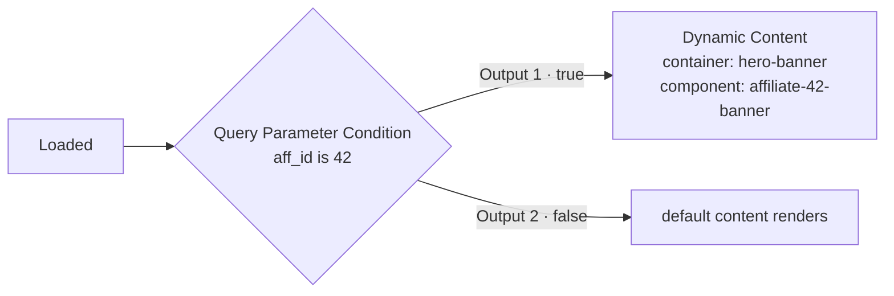

A **dynamic container** is a slot on a page whose contents can be replaced at render time with a saved component. The slot itself carries no logic — a **Dynamic Content** node in [Page Events](/funnels/page-events) decides which component goes in it, and under what conditions.

Use it for affiliate-specific pricing, region-specific offers, source-specific hero sections, or any "same page, different block" scenario.

<Note>
Dynamic containers and split-test containers are **different tags with different purposes**. `<dynamic-container>` swaps content based on a **condition you write**. `<split-test>` swaps content based on a **traffic split**. See [Split Testing](/funnels/split-testing).
</Note>

---

## Core concepts

- **One container = one slot.** A container marks a single location on the page. To vary the header *and* the footer you need two containers.
- **Variants are saved components.** You cannot swap a raw div or section — convert it to a component first. The node stores the component's **code**.
- **The contents of the container are the default.** Whatever you author inside the tag renders whenever no Dynamic Content node fills it.
- **One node fills one container.** Four possible banners in one slot means one container, one component per alternative, and one Dynamic Content node per condition branch.

---

## Step 1 — Create the components

Dynamic content works by swapping **saved components**.

1. Build the section you want to show (a specific pricing table, a banner, a video block).
2. Right-click the element and select **Transform to Component**.
3. Once saved you can delete it from the page — unless it is also your default content.
4. Repeat for every variation.

---

## Step 2 — Add the container

### In the page builder

Right-click the element (or the area where the slot should live) and choose **Wrap in → Dynamic Container**, or drag the **Dynamic Content** block onto the page. Then set the **Dynamic Container Name** trait — that is the label you will pick from in Page Events.

Anything left inside the container is its default content.

### On a coded page

```html
<dynamic-container id="hero-banner" name="Hero Banner">
  <!-- Default content, shown when no Dynamic Content node fills this slot -->
  <div class="banner default-banner">Standard Offer</div>
</dynamic-container>
```

| Attribute | Required | Description |
|-----------|----------|-------------|
| `id` | Yes | What the Page Events node stores and what the renderer matches on. Must be unique on the page. |
| `name` | Yes | Human-readable label shown in the Page Events container dropdown. |

<Warning>
**On coded pages the attribute order is fixed.** The container list is built by scanning the page HTML for `<dynamic-container id="…" name="…">` — `id` must come first, immediately followed by `name`, both in double quotes, with nothing between them. Written any other way the container still renders and can still be filled at runtime, but it **will not appear in the Page Events dropdown**, so you cannot select it in the UI.
</Warning>

### Listing container IDs

The dropdown is populated from:

```
GET /api/brands/{brand}/pages/{page}/component-type/dynamic-container
```

```json
[ { "id": "hero-banner", "name": "Hero Banner", "type": "dynamic-container" } ]
```

The `id` is exactly what the node stores in its `container` field. The same endpoint serves `split-test-container` and `form`.

<Tip>
Click the **reload icon** next to the container or component dropdown in the node to refresh the list after editing and saving the page. If a previously selected container is no longer found, the node resets to *Select dynamic container* — that is your signal that the `id` changed or the tag is no longer being detected.
</Tip>

---

## Step 3 — Fill it from Page Events

Open **Manage Page Events** and add a **Dynamic Content** node (`dynamic_container`).

| Field | Required | Description |
|-------|----------|-------------|
| **Container** | Yes | The `<dynamic-container>` to fill. The node warns *"Container is required"* until set. |
| **Component** | Yes | The component to render into it, chosen by code. The node warns *"Component is required"* until set. |

Connect it beneath whatever decides that this variant applies — an entry node for an unconditional swap, or the appropriate output of a condition.



The node runs on the **server**, before the HTML is sent, and it continues down its output afterwards — so you can chain further actions behind it.

Field detail: [Node Reference → Dynamic Content](/funnels/page-events-nodes#dynamic-content).

---

## How it renders

When a Dynamic Content node targets a container and both `container` and `component` are set, the renderer replaces the **entire** `<dynamic-container>` element — including the default content — with a div carrying the original `id`, holding the resolved component:

```html
<!-- Authored -->
<dynamic-container id="hero-banner" name="Hero Banner">
  <div class="banner default-banner">Standard Offer</div>
</dynamic-container>

<!-- Intermediate -->
<div id="hero-banner"><component type="affiliate-42-banner"></component></div>

<!-- Final output -->
<div id="hero-banner">
  <div data-cid="982"><!-- HTML of affiliate-42-banner --></div>
</div>
```

The component's CSS and interactions are pulled into the page at the same time.

**If nothing fills the container** — no node targets it, the `id` does not match, or the node is missing its container or component — the tag and its default content are left exactly as authored.

<Note>
The `name` attribute plays no part in matching at render time; matching is on `id` alone. `name` exists so a human can find the container in the Page Events dropdown.
</Note>

---

## Examples

### Affiliate-specific banner

```html
<dynamic-container id="hero-banner" name="Hero Banner">
  <div class="banner default-banner">Standard Offer</div>
</dynamic-container>
```

In Page Events:

1. **Loaded** → **Referred By Affiliate** (select the affiliate)
2. Output 1 → **Dynamic Content** → container `Hero Banner`, component `affiliate-42-banner`
3. Output 2 → nothing; the default banner renders

### Two independent slots on one page

```html
<dynamic-container id="headline-slot" name="Headline Slot">
  <h1>Default Headline</h1>
</dynamic-container>

<dynamic-container id="footer-disclaimer-slot" name="Footer Disclaimer">
  <p>Default disclaimer text</p>
</dynamic-container>
```

Each slot needs its own Dynamic Content node. They can hang off the same condition — chain them, since the node continues after filling its container.

### Country-specific pricing

1. **Loaded** → **Is From Country** with `CA` selected
2. Output 1 → **Dynamic Content** → container `pricing`, component `pricing-cad`
3. Output 2 → **Is From EU** → Output 1 → **Dynamic Content** → container `pricing`, component `pricing-eur`
4. Everything else falls through to the container's default content

---

## Use cases

- **Affiliate-specific content** — different pricing or bonuses per referral source
- **Location-based offers** — region-specific copy, currency or compliance text
- **Traffic source targeting** — a hero that matches the ad the visitor clicked
- **Customer vs prospect** — a different block for people who have already bought
- **Whitelisted vs compliant** — pair with the whitelist nodes for review-safe content

---

## The `<component>` tag

`<component>` embeds a saved component directly, with no Page Events involved. This is what a filled dynamic container becomes internally, and you can use it anywhere on a page.

```html
<component type="general-footer"></component>
```

| Attribute | Required | Description |
|-----------|----------|-------------|
| `type` | Yes | The code of the component to embed. |

Renders as:

```html
<div data-cid="[component_id]">
  <!-- HTML of the component -->
</div>
```

If the code is not found, the server renders an inline error so the problem is visible rather than silent:

```html
<ef-error>Component <u>my-component-code</u> was not found.</ef-error>
```

<Note>
Component lookup tolerates the `custom-` prefix: `general-footer-2` and `custom-general-footer-2` resolve to the same component when one of them exists. Components that embed themselves are not re-expanded, so a self-referencing component will not loop.
</Note>

---

## Troubleshooting

<AccordionGroup>
  <Accordion title="The container dropdown is empty">
    On builder pages, check the block is a **Dynamic Container** and that its **Dynamic Container Name** trait is filled in. On coded pages, check the tag is written exactly as `<dynamic-container id="…" name="…">` with `id` immediately before `name`. Save the page, then click the reload icon on the node.
  </Accordion>
  <Accordion title="The component dropdown is empty or missing my component">
    Save the page after creating components, then click the reload icon next to the component dropdown. Components must be saved as components — raw sections do not appear.
  </Accordion>
  <Accordion title="Default content renders instead of the component">
    Confirm the node's branch actually ran (the [Debug Window](/debugging/debug-window) → Page Events tab shows which path was taken), and that the node has **both** a container and a component set. A node missing either field is skipped silently.
  </Accordion>
  <Accordion title="The wrong slot got swapped">
    Two containers sharing the same `id` will both be matched. Make `id` unique per page.
  </Accordion>
  <Accordion title="I need traffic split between versions, not a condition">
    That is a component split test, not dynamic content. See [Split Testing](/funnels/split-testing).
  </Accordion>
</AccordionGroup>

---

## Related

<CardGroup cols={2}>
  <Card title="Node Reference" href="/funnels/page-events-nodes" />
  <Card title="Page Events" href="/funnels/page-events" />
  <Card title="Split Testing" href="/funnels/split-testing" />
  <Card title="Containers" href="/pages/containers" />
  <Card title="Script Rule" href="/funnels/script-rule" />
  <Card title="Query Parameters" href="/funnels/query-parameters" />
</CardGroup>
