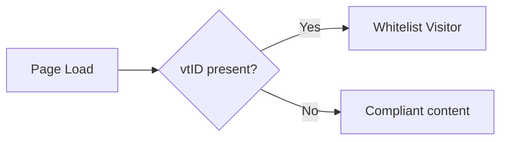

Page Events are a **visual flow builder** for your funnel: you connect triggers, conditions, and actions so the right thing happens at the right time—whitelisting, popups, video CTAs, merchant switching, and more.

## Quick navigation

<CardGroup cols={2}>
  <Card title="How it works" icon="diagram-project" href="#how-page-events-work">
    Execution order, entry points, and the difference between server and browser nodes
  </Card>
  <Card title="Server-side nodes" icon="server" href="#server-side-nodes">
    Query parameters, Script Rules, Load Page, Set Merchant, Dynamic Container, and more
  </Card>
  <Card title="Browser (frontend) nodes" icon="bolt" href="#browser-nodes">
    Triggers, conditions, and actions that run in the visitor’s browser
  </Card>
  <Card title="Patterns & troubleshooting" icon="puzzle-piece" href="#common-patterns">
    Example flows and how to fix common issues
  </Card>
</CardGroup>

---

## How Page Events Work

### Execution order
- **Left to right** — Nodes run in order along the connections.
- **Top to bottom** — When several nodes connect from one source, they run from top to bottom.
- **Sequential** — Each node finishes before the next one runs.

### Entry points
Flows start from:
- **Page Load** — When the page loads
- **Form Submit** — When a form is submitted
- **Button Click** — When specific buttons are clicked
- **Exit Intent** — When the visitor moves to leave (e.g. cursor to browser chrome)

### Server vs browser
- **Server-side nodes** (e.g. Query Parameter, Script Rule, Load Page, Set Merchant, Dynamic Container) run **before** the page is sent. Use them for routing, whitelisting, and content selection.
- **Browser (frontend) nodes** (e.g. Video pause, When scrolled to, Exit popup, Show Video CTA) run **in the visitor’s browser** after the page loads. Use them for scroll, video, and popup behavior.

---

## Server-side nodes

These run on the server before the page is rendered. They’re the main building blocks for **who sees what** and **which content loads**.

### Conditions

| Node | What it does |
|------|----------------|
| **Query Parameter Condition** | Branches based on URL parameters (e.g. `vtID=k`, `source=facebook`). Supports equals, not equals, contains, is empty, is not empty. |
| **Script Rule** | Custom JavaScript with access to visitor data, device, geo, referrer. Returns `true`/`false` to choose the path. Runs server-side. |
| **Split Test Component** | Randomly assigns visitors to variants. Set traffic % per variant and connect each to different content or actions. |

<CardGroup cols={2}>
  <Card title="Query Parameter Conditions" icon="link" href="/funnels/query-parameters">
    Full guide to URL parameters and operators
  </Card>
  <Card title="Script Rule" icon="code" href="/funnels/script-rule">
    Variables, examples, and debugging
  </Card>
</CardGroup>

### Actions

| Node | What it does |
|------|----------------|
| **Whitelist Visitor** | Marks the visitor as whitelisted for the session. Gives access to Whitelisted containers. |
| **Mark Visitor as Not Whitelisted** | Removes whitelist so the visitor sees compliant content again. |
| **Load Page** | Loads a different page **into the same URL**. No redirect; good for compliance. |
| **Redirect to URL** | Sends the visitor to another URL (internal or external). |
| **Dynamic Container** | Swaps content inside a container (e.g. different pricing by affiliate or location). |
| **Set Merchant** | Overrides the payment processor for the page (e.g. Buygoods, Clickbank). Controls which Merchant Container shows. |
| **Clear Merchant** | Resets merchant to the domain default. Use after tests or when leaving a special flow. |

<Card title="Dynamic Content" icon="layer-group" href="/funnels/dynamic-content">
  Set up containers and swap components by condition
</Card>

### Utility

| Node | What it does |
|------|----------------|
| **Sequence** | Runs connected nodes one by one in order. Use when execution order matters. |
| **Router** | Junction point for flows. Can generate unique URLs for testing. |

<Card title="Sequence Nodes" icon="list-ol" href="/funnels/sequence-nodes">
  When and how to use sequences
</Card>

---

## Browser (frontend) nodes

These run **in the visitor’s browser** after the page loads. They appear as triggers (e.g. in the funnel’s trigger list) or as steps inside a flow.

### Triggers

Triggers **wait for an event**, then run the next step.

<AccordionGroup>
  <Accordion title="Exit intent">
    Fires when the cursor moves toward the browser chrome (e.g. closing the tab). Use to show an exit popup. No settings.
  </Accordion>
  <Accordion title="Mobile exit intent">
    Same idea on touch devices (e.g. fast upward scroll). No settings.
  </Accordion>
  <Accordion title="When scrolled to">
    Fires when the visitor scrolls to a position. **Settings:** Pixels from top, or % of page (0–100). Either can trigger.
  </Accordion>
  <Accordion title="Video pause">
    Fires when the visitor pauses the video (Vidalytics, TrackPlay, SmartPlayer, or HTML5). No settings.
  </Accordion>
  <Accordion title="Video watched (seconds / %)">
    Fires when the video reaches a time or percentage. **Settings:** Seconds and/or Percent of video length.
  </Accordion>
  <Accordion title="On CTA shown">
    Fires when the video CTA is shown. No settings.
  </Accordion>
  <Accordion title="On form success">
    Fires when a form is successfully submitted. **Setting:** Form ID (the form element’s `id`).
  </Accordion>
  <Accordion title="On add to cart">
    Fires when the visitor adds a product to cart. No settings.
  </Accordion>
</AccordionGroup>

### Conditions

Conditions **check current state** and send the flow to **Output 1** or **Output 2**.

<AccordionGroup>
  <Accordion title="Element in view">
    Is the element visible in the viewport? **Settings:** CSS selector; Min % of element visible (0–100). **Outputs:** 1 = in view, 2 = not yet.
  </Accordion>
  <Accordion title="Scroll check">
    Has the visitor already scrolled to a position? Uses separate desktop/mobile thresholds (mobile = viewport &lt; 768px). **Settings:** Desktop and mobile — Pixels from top and/or % of page. **Outputs:** 1 = scrolled to position, 2 = not yet.
  </Accordion>
  <Accordion title="Video progress check">
    Has the video reached a time or percentage? **Settings:** Seconds and/or Percent. **Outputs:** 1 = reached, 2 = not reached.
  </Accordion>
  <Accordion title="Video is muted">
    Is the main video muted? **Outputs:** 1 = muted, 2 = not muted.
  </Accordion>
  <Accordion title="Showed CTA">
    Has the video CTA already been shown this session? **Outputs:** 1 = shown, 2 = not shown.
  </Accordion>
  <Accordion title="Has tag">
    Is a tag (cookie) set? **Setting:** Tag name. **Outputs:** 1 = set, 2 = not set.
  </Accordion>
  <Accordion title="Affiliate whitelisted">
    Is the current affiliate (from `aff_id` in URL) whitelisted? **Outputs:** 1 = whitelisted, 2 = not.
  </Accordion>
  <Accordion title="Split test">
    Splits traffic between paths. Variants and weights are set in the editor. **Outputs:** One per variant.
  </Accordion>
</AccordionGroup>

### Actions

Actions **do something** and then continue to the next step.

<AccordionGroup>
  <Accordion title="Exit popup">
    Shows an exit popup by ID. **Setting:** Popup ID.
  </Accordion>
  <Accordion title="Show Video CTA">
    Shows the video CTA block. **Setting:** Scroll to CTA — if checked, the page scrolls to the CTA when shown.
  </Accordion>
  <Accordion title="Hide Video CTA">
    Hides the video CTA and restores elements that are hidden when the CTA is shown. No settings.
  </Accordion>
  <Accordion title="Wait (seconds)">
    Pauses the flow for a number of seconds. **Setting:** Seconds.
  </Accordion>
  <Accordion title="Show element / Hide element">
    Shows or hides an element by CSS selector (`display: block` or `display: none`). **Setting:** CSS selector.
  </Accordion>
  <Accordion title="URL redirect">
    Sends the visitor to another URL. Flow stops after. **Setting:** URL.
  </Accordion>
  <Accordion title="Add tag">
    Sets a tag (cookie) for use with **Has tag** later. **Setting:** Tag name.
  </Accordion>
  <Accordion title="Mark whitelisted / Mark not whitelisted">
    Sets the whitelist cookie. **Settings:** Encrypted value (from backend), Expiration (minutes).
  </Accordion>
  <Accordion title="Client script">
    Runs a JavaScript snippet in the page, then continues. **Setting:** Script. Use for pixels or small custom logic.
  </Accordion>
  <Accordion title="Execute automation">
    Triggers an automation via the API. **Setting:** Token (from backend).
  </Accordion>
</AccordionGroup>

---

## Common patterns

### Whitelisting from URL

1. **Page Load** → **Query Parameter Condition** (`vtID` is not empty)
2. **Yes** → **Whitelist Visitor**
3. **No** → Continue with default content

### Merchant by traffic source

1. **Page Load** → **Query Parameter Condition** (`source` equals `partner1`)
2. **Yes** → **Set Merchant** (e.g. Buygoods)
3. **No** → **Query Parameter Condition** (`source` equals `partner2`)
4. **Yes** → **Set Merchant** (e.g. Clickbank)
5. **No** → Use domain default merchant

<Note>
Use **Clear Merchant** when you need to reset back to the default (e.g. after a test or on the next page load when the condition is no longer met).
</Note>

### Video: pause at 30% then show CTA

1. **Video pause** (trigger) → **Video progress check** (30%)
2. **Reached** → **Wait** (2 seconds) → **Show Video CTA** (optionally with “Scroll to CTA”)
3. **Not reached** → (do nothing or another path)

### Dynamic content by affiliate

1. **Page Load** → **Script Rule** (e.g. check affiliate ID)
2. **Affiliate 100** → **Dynamic Container** (show special pricing)
3. **Other** → **Dynamic Container** (show default pricing)

---

## Best practices

- **Keep flows readable** — Use sequences to group related steps and name nodes clearly.
- **Test both branches** — For every condition, verify the Yes and No paths.
- **Prefer simple conditions first** — Query parameters are faster than Script Rules when they’re enough.
- **Avoid very long chains** — Long flows are harder to debug and can affect load.

<Tip>
Use the **Rearrange** control in the events builder to auto-layout the canvas. Save and reload to keep the layout.
</Tip>

---

## Troubleshooting

<AccordionGroup>
  <Accordion title="Events not firing">
    Check that triggers are connected from the correct entry point (e.g. trigger list for Video pause / When scrolled to) and that the next step is wired. For frontend nodes, ensure the node type is in the frontend list so it’s included in `page_events`.
  </Accordion>
  <Accordion title="Conditions always Yes or always No">
    Verify parameter names and values (case-sensitive). For Script Rules, use the Debug Window to see the data the script receives.
  </Accordion>
  <Accordion title="Content or popup not updating">
    Confirm container names and popup IDs. For Dynamic Container, ensure the target component is saved and the container is correctly set in the node.
  </Accordion>
  <Accordion title="Page not loading or redirecting wrong">
    Look for redirect or Load Page nodes in the path and for possible loops (e.g. condition always taking the same branch back into the flow).
  </Accordion>
</AccordionGroup>

---

## Related docs

<CardGroup cols={2}>
  <Card title="Query Parameters" href="/funnels/query-parameters" />
  <Card title="Script Rule" href="/funnels/script-rule" />
  <Card title="Dynamic Content" href="/funnels/dynamic-content" />
  <Card title="Exit Popups" href="/funnels/exit-popups" />
  <Card title="Sequence Nodes" href="/funnels/sequence-nodes" />
  <Card title="Debug Window" href="/debugging/debug-window" />
</CardGroup>
