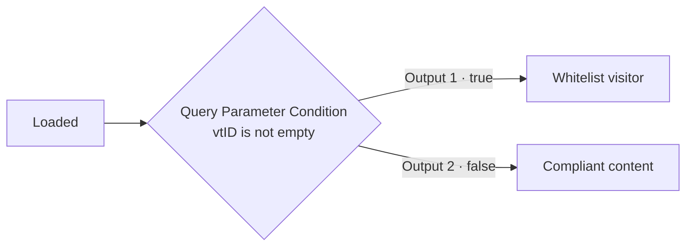

Page Events is a **flow graph attached to a page**. You connect triggers, conditions and actions, and the platform runs them — some before the HTML is sent, some in the visitor's browser after load. It is what powers whitelisting, dynamic content, component split tests, exit popups, merchant switching and video CTAs.

Open it from **Pages → (your page) → Manage Page Events**.

<CardGroup cols={2}>
  <Card title="Node reference" icon="list-tree" href="/funnels/page-events-nodes">
    Every node type, its fields, and its wiring constraints
  </Card>
  <Card title="The graph model" icon="diagram-project" href="#the-graph-model">
    Nodes, connections, entry views, and how it is stored
  </Card>
  <Card title="Server vs browser" icon="server" href="#server-vs-browser">
    Which nodes run before the page is sent, and which run after
  </Card>
  <Card title="Patterns" icon="puzzle-piece" href="#common-patterns">
    Worked examples and troubleshooting
  </Card>
</CardGroup>

---

## The graph model

A page's events are a **directed graph of nodes**. Every node has:

- a **type** (`data.type`) — the real identity of the node, e.g. `script_rule`, `dynamic_container`, `component_split_test`
- a **node code** (`data.node_code`) — a short stable identifier used by analytics and split-test reporting
- **input and output pins** — `input_1`, `output_1`, `output_2`… Connections are stored on both ends, so a link appears in the source node's `outputs.output_N.connections` and in the target's `inputs.input_M.connections`.
- a **position** on the canvas (`pos_x`, `pos_y`)

### Reading a branch

Outputs are ordered, and the order is the meaning:

- **Output 1** — the first pin. For a condition node this is the **true / Yes** branch.
- **Output 2** — the second pin. For a condition node this is the **false / No** branch.

Every node except **Sequence** follows **one connection per output**. If you need two actions on the same branch, either chain them (most actions have an output that continues the flow) or use a **Sequence** node and add an output per action.

### Entry views

Every flow starts from an **entry node** (the node labelled *Loaded*). A page may have several.

Each entry node appears as a **View** in the left rail of the builder. You can name it (pencil icon), reorder the list by dragging, and each view remembers its own camera position on the canvas. The order is saved as `entry_views_order`.

<Warning>
Views are a **canvas organisation feature, not a routing feature.** At render time the platform collects the children of **every** entry node and runs them all — it does not choose one view. `entry_views_order` affects the builder only. If two views must be mutually exclusive, put the choice behind a condition.
</Warning>

### Global page events

Alongside per-page events, a brand has one **Global Page Events** graph — open it with **Manage Global Page Events** in the builder toolbar. Global events are merged into every page's flow and are **ordered ahead of the page's own events**. Use them for brand-wide concerns (cloaking, IP rules, universal tagging) instead of copying the same nodes onto every page.

### Where it is stored

Page events are loaded and saved through:

```
GET  /api/brands/{brand}/pages/{page}/events
POST /api/brands/{brand}/pages/{page}/events
```

Use `global` in place of the page ID for the brand-wide graph. Save is **POST only — there is no PUT**, and these are session-authenticated app endpoints, not public API-key endpoints.

The response body is the builder's export:

```jsonc
{
  "drawflow": { "Home": { "data": {
    "1": {
      "id": 1,
      "name": "entry",
      "data": { "type": "entry", "value": "3202", "node_code": "…", "view_name": "Main" },
      "inputs":  {},
      "outputs": { "output_1": { "connections": [ { "node": "2", "output": "input_1" } ] } },
      "pos_x": 960, "pos_y": 2154
    }
  } } },
  "canvas_x": -1290,
  "canvas_y": -1867,
  "entry_views_order": [1, 5, 9]
}
```

<Note>
When a page has no events yet, `GET .../events` returns **`200` with an empty body** — not `{}` and not `404`. Handle that case if you are reading the endpoint programmatically.
</Note>

On save, the platform compiles the graph into a flattened execution tree, assigns `node_code`s where missing, and creates or updates the split-test records referenced by any `split_test` / `component_split_test` node.

---

## Server vs browser

Each node declares where it can run. The platform splits your graph into a **server pass** and a **browser payload**.

| | Server (before the HTML is sent) | Browser (after the page loads) |
|---|---|---|
| **Use for** | routing, whitelisting, cloaking, content selection, merchant/checkout setup | scroll, video, exit intent, popups, DOM changes, pixels |
| **Examples** | Script Rule, Query Parameter Condition, Dynamic Content, Component Split Test, Load Another Page, Set Merchant, Block Request | On Exit Intent, When scrolled to, Video checks, Show Popup, Show/Hide Element, Execute Javascript on Client |

**How the split is decided:** a branch is sent to the browser if it — or anything below it — is a browser-only node. Certain nodes are pinned to the server even when they have browser children (`script_rule`, `page_variant`, `product_check`, `cloaking_house`, `is_whitelisted`, `url_redirect`, `set_variable`, `set_checkout_bumps`, `block_request`, `split_test`, `execute_automation`). When such a node picks a branch that belongs to the browser, the server hands that branch over to the browser payload and stops there.

<Warning>
**Order matters and it is one-directional.** Server → browser works (`script_rule` → `client_script`). Browser → server does not (`exit_intent` → `script_rule`). Put every server-side decision before the first browser node on a path.
</Warning>

Browser events are serialised into the page as `window.page_events` and executed by the funnel runtime script. **Save your flow and reload the page** to pick up changes.

---

## Node catalogue

The full list — purpose, fields, inputs/outputs and constraints for every node — lives in the [Page Events Node Reference](/funnels/page-events-nodes). Quick orientation:

<AccordionGroup>
  <Accordion title="Flow control">
    **Loaded** (entry) · **Router** · **Sequence** · **Stop Next Events Execution**
  </Accordion>
  <Accordion title="Conditions — server">
    **Script Rule** · **Query Parameter Condition** · **Is Customer** · **Has Purchased Any Upsell** · **Referred By Affiliate** · **Is From Country / State / EU / Timezone** · **Is Using VPN/Proxy** · **Is Whitelisted?** · **Has Tag** · **Cloaking.house** · **Product Check** (+ Match Product / Match All)

    All of these compile to a script and take the **true** branch on Output 1.
  </Accordion>
  <Accordion title="Conditions & triggers — browser">
    **On Exit Intent** · **On Form Success** · **On Add To Cart** · **CTA: On Shown** · **When scrolled to** · **Scroll Check** · **Element In View** · **If Showed CTA** · **If Added To Cart** · **Video: Is muted / On Pause / On Goal Reached / Progress Check**
  </Accordion>
  <Accordion title="Content & routing">
    **Dynamic Content** · **Load Another Page** · **Redirect to Page** · **Redirect to URL** · **Show Popup** · **Show / Hide Element** · **Show / Hide Video CTA** · **Wait Seconds** · **Execute Javascript on Client**
  </Accordion>
  <Accordion title="Session, commerce & security">
    **Tag User** · **Whitelist visitor** · **Mark visitor as NOT whitelisted** · **Set Merchant** · **Clear Merchant** · **Set Checkout Page** · **Set Checkout Bumps** · **Set Variable** · **Execute Automation on Customer** · **Block Request**
  </Accordion>
  <Accordion title="Split testing">
    **Component Split Test** · **Split Test** · **Traffic Distribution** · **Component**

    See [Split Testing](/funnels/split-testing) for the full wiring.
  </Accordion>
</AccordionGroup>

<Note>
Nodes are filtered by permission. If a node is missing from **Add Node**, your role probably lacks its permission — for example split-test nodes need `split_tests.create` / `split_tests.update`, and **Set Checkout Bumps** only appears on pages flagged as checkout pages.
</Note>

---

## Common patterns

### Whitelisting from a URL parameter


```mermaid
flowchart LR
  A[Loaded] --> B{Query Parameter Condition<br/>vtID is not empty}
  B -->|Output 1 · true| C[Whitelist visitor]
  B -->|Output 2 · false| D[Compliant content]
```

1. **Loaded** → **Query Parameter Condition** (`vtID`, operator `is not empty`)
2. Output 1 → **Whitelist visitor** (`0` minutes = permanent)
3. Output 2 → leave empty, or route to compliant content

### Blocking traffic outside a country

1. **Loaded** → **Is From Country** with `US` selected
2. Output 1 (true) → leave empty
3. Output 2 (false) → **Block Request** with your message

<Warning>
Attach **Block Request** to the specific output of the condition. Dropping it directly under the entry node blocks **every** visitor.
</Warning>

### Merchant by traffic source

1. **Loaded** → **Query Parameter Condition** (`source` `is` `partner1`) → Output 1 → **Set Merchant**
2. Output 2 → a second **Query Parameter Condition** (`source` `is` `partner2`) → Output 1 → **Set Merchant**
3. Output 2 → nothing; the domain default applies

Use **Clear Merchant** to explicitly return to the domain default.

### Video: pause, then show the CTA

1. **Video: On Pause** → **Video: Progress Check** (`30`%)
2. Output 1 → **Wait Seconds** (`2`) → **Show Video CTA** (with **Scroll to CTA** if you want the page to jump)
3. Output 2 → nothing

### Swapping content for one affiliate

1. **Loaded** → **Referred By Affiliate** (pick the affiliate)
2. Output 1 → **Dynamic Content** → container `pricing`, component `affiliate-pricing`
3. Output 2 → nothing; the container's default content renders

See [Dynamic Content](/funnels/dynamic-content).

---

## Best practices

- **Prefer the purpose-built condition over a Script Rule.** *Is From Country*, *Is Using VPN/Proxy*, *Query Parameter Condition* and friends are readable at a glance and self-documenting. Save Script Rule for logic they cannot express.
- **Combine instead of nesting.** One *Is From Country* with three countries beats three chained nodes. If a chain would be three levels deep, write one Script Rule.
- **Put server decisions first.** Everything that routes, cloaks or selects content should run before the first browser node.
- **Name your split tests and variants.** Those names are what you read in analytics later.
- **Use views to keep the canvas readable**, not to separate behaviour — every view runs.

<Tip>
Use **Rearrange** in the toolbar to auto-layout the canvas, then save. Camera position is stored per view, so each one reopens where you left it.
</Tip>

---

## Troubleshooting

<AccordionGroup>
  <Accordion title="Nothing happens on the page">
    Save the flow and reload the page — browser nodes are shipped with the HTML, so an unsaved change is not live. Then check that the branch is actually reachable: a node wired to nothing, or attached below a condition whose other branch is being taken, will not run.
  </Accordion>
  <Accordion title="A branch runs when it should not">
    Check which output you attached to. **Output 1 is true, Output 2 is false.** This trips people up most often with *Block Request* and *Load Another Page*.
  </Accordion>
  <Accordion title="Only one of my two actions runs">
    Every node except **Sequence** allows one connection per output. Add a **Sequence** node and give it an output per action, or chain the actions.
  </Accordion>
  <Accordion title="A node refuses to connect">
    The builder enforces parent restrictions. **Component** only attaches to **Traffic Distribution**; **Traffic Distribution** only to a split-test node; **Video: Is muted** only below **On Exit Intent**; **Product Check: Match Product/All** only below **Product Check**. See [wiring rules](/funnels/page-events-nodes#wiring-rules).
  </Accordion>
  <Accordion title="Everything after my split test is ignored">
    A **Component Split Test** ends its branch after swapping the container. Wire follow-up work before it, not after it.
  </Accordion>
  <Accordion title="A condition always takes the same path">
    Open the [Debug Window](/debugging/debug-window) → **Page Events** tab. It shows each Script Rule's result, execution time, console output and the full data it received. Remember that parameter names and values are case-sensitive.
  </Accordion>
  <Accordion title="Split-test or container dropdown is empty">
    The container list is read from the page itself. On builder pages the container must be a **Split Test Container** / **Dynamic Container** block with its name trait filled in; on coded pages the tag must be written as `<split-test id="…" name="…">` with `id` immediately before `name`. Click the reload icon next to the dropdown after saving the page.
  </Accordion>
</AccordionGroup>

---

## Related docs

<CardGroup cols={2}>
  <Card title="Node Reference" href="/funnels/page-events-nodes" />
  <Card title="Script Rule" href="/funnels/script-rule" />
  <Card title="Query Parameters" href="/funnels/query-parameters" />
  <Card title="Dynamic Content" href="/funnels/dynamic-content" />
  <Card title="Split Testing" href="/funnels/split-testing" />
  <Card title="Sequence Nodes" href="/funnels/sequence-nodes" />
  <Card title="Exit Popups" href="/funnels/exit-popups" />
  <Card title="Window API" href="/funnels/window-api" />
  <Card title="Page Variants" href="/pages/page-variants" />
  <Card title="Debug Window" href="/debugging/debug-window" />
</CardGroup>
