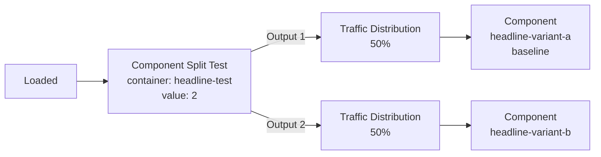

A **component split test** replaces one section of a page — a headline, a video block, a pricing table — with a different saved component per visitor, and reports on the result.

It has two halves:

1. A **`<split-test>` container** in the page marks *where* the swap happens.
2. A **Component Split Test** node in [Page Events](/funnels/page-events) defines *what* the variants are and how traffic splits.

<Note>
Testing whole pages instead of a section? See [Page Variants](/pages/page-variants) and [Funnel Split Testing](/funnels/funnel-split-testing), and the [comparison below](#which-kind-of-test-do-i-want).
</Note>

---

## Step 1 — Put a container on the page

The container is an empty slot identified by an **`id`**. It also carries a **`name`**, which is the label you will pick from in Page Events.

### In the page builder

Drag the **Split Test Container** block (Funnels category) onto the page, then set its **Split Test Container Name** trait. The builder writes it as a `<split-test>` element with the name stored on the component.

### On a coded page

```html
<split-test id="headline-test" name="Headline Test">
  <!-- Fallback: shown when no Component Split Test node resolves a variant -->
  <component type="headline-variant-a"></component>
</split-test>
```

| Attribute | Required | Description |
|-----------|----------|-------------|
| `id` | Yes | What the Page Events node stores and what the renderer matches on. Must be unique on the page. |
| `name` | Yes | Human-readable label shown in the Page Events container dropdown. |

<Warning>
**On coded pages the attribute order is fixed.** The container list is built by scanning the page HTML for `<split-test id="…" name="…">` — `id` must come first, immediately followed by `name`, both in double quotes, with no other attributes between them. Written any other way, the container still renders but **will not appear in the Page Events dropdown**.
</Warning>

Anything inside the tag is the **fallback**: it renders unchanged whenever no variant is resolved.

### Listing container IDs

The builder populates its dropdown from:

```
GET /api/brands/{brand}/pages/{page}/component-type/split-test-container
```

```json
[ { "id": "headline-test", "name": "Headline Test", "type": "split-test-container" } ]
```

The `id` in that response is exactly what goes into the node's `container` field.

<Note>
The type segment is `split-test-container`, not `split-test`. `<split-test>` is the HTML tag; `split-test-container` is the component type. The same endpoint serves `dynamic-container` and `form`.
</Note>

---

## Step 2 — Create the variant components

Each variant is a **saved component**. In the page builder, right-click an element and choose **Create a new component** (or build one from scratch), then repeat for each variant. What matters downstream is the component's **code** — that is what the node stores.

---

## Step 3 — Wire the nodes

Open **Manage Page Events** for the page. A component split test is always the same three-level shape:



<Steps>
  <Step title="Add the Component Split Test node">
    Connect it to the entry node or to a condition. Set:

    - **Container** — the `<split-test>` container. Stored as `container`. The node warns *"Container is required"* until it is set.
    - **Total Variants** — `2` to `5`. Stored as `value`.
    - **Name** — used in split-test reporting.
  </Step>
  <Step title="Let it create the weights">
    Changing **Total Variants** adds an output pin **and a Traffic Distribution node** for each variant automatically. Reducing the count removes both the pin and the node attached to it.
  </Step>
  <Step title="Set the traffic split">
    Each **Traffic Distribution** node holds a percentage (`value`, 0–100) and a variant **name**. Editing one weight redistributes the remainder evenly across its siblings, so two variants land on 50/50 by default.
  </Step>
  <Step title="Attach one Component per weight">
    Under each Traffic Distribution node attach a **Component** node and pick the component. Turn on **Set as Baseline** on the control — that is the variant everything else is compared against.
  </Step>
</Steps>

<Warning>
The **Component Split Test node ends its branch.** It performs the swap and stops. Anything you wire after it — rather than under a Traffic Distribution node — never runs.
</Warning>

### Wiring constraints

| Node | Can only attach to |
|------|--------------------|
| **Traffic Distribution** (`split_test_weight`) | a **Component Split Test** or **Split Test** node |
| **Component** (`component_split_test_component`) | a **Traffic Distribution** node |

Only one Component per Traffic Distribution node, and only one Traffic Distribution per output pin.

Field-by-field detail: [Node Reference → Split testing](/funnels/page-events-nodes#split-testing).

---

## Worked example — split test a headline

**The page**

```html
<split-test id="headline-test" name="Headline Test">
  <component type="headline-a"></component>
</split-test>
```

**The components**

| Code | Content |
|------|---------|
| `headline-a` | `<h1>Buy Now</h1>` — the control |
| `headline-b` | `<h1>Buy Now and Save 50% Today</h1>` — the challenger |

**Page Events**

1. **Loaded** → **Component Split Test**
   - Container: `Headline Test`
   - Total Variants: `2`
   - Name: `Headline — hero`
2. Output 1 → **Traffic Distribution** — name `Control`, `50`
3. Output 2 → **Traffic Distribution** — name `Discount angle`, `50`
4. Under *Control* → **Component** `headline-a`, **Set as Baseline** on
5. Under *Discount angle* → **Component** `headline-b`

Save. The split-test record is created on save, and the node gains a **View Results** link.

**What the visitor receives**

```html
<div data-sid="41" data-fnid="17" data-cid="982">
  <h1>Buy Now and Save 50% Today</h1>
</div>
```

- `data-sid` — the split test ID
- `data-fnid` — the Page Events node ID
- `data-cid` — the component ID that was served

The tracking script reads those attributes to record the view, and the assignment is attached to any conversion in the same session.

---

## How a variant is chosen

<Steps>
  <Step title="Declared winner wins outright">
    If a variant has been marked as winner, every visitor gets it and the weights are ignored. Marking a winner writes that Traffic Distribution node's `node_code` onto the parent as `winner_node_code`.
  </Step>
  <Step title="Otherwise, a returning visitor keeps their variant">
    The assignment is stored in a cookie named `st_res_<split_test_id>` (7 days, `httpOnly`) and mirrored into the session. If the stored component no longer exists in the test, the assignment is discarded and re-run.
  </Step>
  <Step title="Otherwise, exact rotation">
    New visitors are allocated from a **shared counter** rather than a per-visitor dice roll, so the live ratio tracks your configured weights closely instead of converging on them slowly. The counter is Redis-backed, so it holds across workers and servers; a weighted random draw is the fallback if that is unavailable.
  </Step>
</Steps>

<Note>
Changing the weights or adding/removing a variant resets the rotation counter for the test. Existing visitors keep their cookie until it expires.
</Note>

**When nothing is resolved**, the `<split-test>` block is left exactly as authored and its inner content renders. That happens if no Component Split Test node targets the container, if the container `id` does not match, or if the node has no `split_test_id` yet (which is the case before the first save, and if the plan does not include split tests).

---

## Advanced settings

**Advanced Settings** on the Component Split Test node opens the statistical configuration for the underlying split test record: test duration, sample-size limits, significance level, statistical power, minimum detectable effect, multiple-testing correction, statistical method, primary metric, secondary metrics to watch (`winner_selection_criteria`), guardrail metrics, automated winner selection, and **custom goals**.

Custom goals are `{ name, value }` pairs where `value` must match an interaction name defined in the page builder.

Once the node has a `split_test_id`, saving this modal writes straight through to the split test record. Interpreting the results is covered in [Split Test Analytics](/analytics/split-test).

### Enforce Exact Split

The **Enforce Exact Split** checkbox stores `enforce_exact_split` on the node.

<Note>
The current renderer does not read this flag. Component split tests already allocate traffic exactly, via the shared counter described above — leaving the box unchecked does not make allocation random.
</Note>

---

## Which kind of test do I want?

| | **Component Split Test** | **Load Another Page** (`page_variant`) | **Split Test** (`split_test`) |
|---|---|---|---|
| **What varies** | One container inside one page | The entire page body | A whole branch of the flow |
| **URL** | Unchanged | Unchanged — the other page renders at the same URL | Unchanged or changed, depending on what each branch does |
| **Set up as** | `component_split_test` → weights → components | A `page_variant` node on a branch | `split_test` → weights → whatever each branch does |
| **Runs on** | Server only | Server only | Server or browser |
| **Use when** | You are testing copy, an image, a video block, a pricing table | You are testing a materially different page but want one URL | You are testing whole paths, or combining a page test with other actions |

**Rules of thumb**

- Testing **one section**? Component split test. It is the cheapest to build and the easiest to read.
- Testing a **whole page layout**? Build the alternative as a page variant and select it with **Load Another Page**. To split traffic between variants, put a **Split Test** node in front and hang a **Load Another Page** under each Traffic Distribution node.
- Need the variants to have **their own page events**? Turn on **Load & Override Page Events** on the Load Another Page node. Left off, the variant inherits the primary page's events.
- Testing **different steps of a funnel** rather than different renderings of one step? That is [Funnel Split Testing](/funnels/funnel-split-testing).

<Warning>
Do not stack a component split test and a page-variant test on the same page at the same time unless you want a factorial design. Two overlapping tests make each one's numbers much harder to read.
</Warning>

---

## Inline split tests (coded pages)

Use `<inline-split-test>` when you want to A/B test content **directly in the HTML** without creating separate components or configuring Page Events. Variants and their content live inside the tag itself.

<Note>
This is the simplest way to split test on coded pages. For component-based variants, multi-variant reporting or anything driven by conditions, use the `<split-test>` container above.
</Note>

### Syntax

```html
<inline-split-test name="My Test">
    <variant name="variant a" weight="50">
        <!-- HTML for variant A -->
    </variant>
    <variant name="variant b" weight="50">
        <!-- HTML for variant B -->
    </variant>
</inline-split-test>
```

**Attributes**

| Element | Attribute | Required | Description |
|---------|-----------|----------|-------------|
| `<inline-split-test>` | `name` | Yes | Human-readable name for the split test. Used as the record name in the database and analytics dashboard. The tag is ignored on save if `name` is missing. |
| `<inline-split-test>` | `id` | Auto-generated | Database record ID. Injected automatically on save — do not set or edit manually. The runtime needs it: a tag without an `id` is left untouched. |
| `<variant>` | `name` | Yes | Unique name for the variant. Used to identify and track the variant across saves. |
| `<variant>` | `weight` | No | Traffic percentage (0–100). If no variant carries a positive weight, traffic splits evenly. |

### Basic example (equal split)

```html
<inline-split-test name="Headline Test">
    <variant name="short headline">
        <h1>Buy Now</h1>
    </variant>
    <variant name="long headline">
        <h1>Buy Now and Save 50% Today</h1>
    </variant>
</inline-split-test>
```

This creates a 50/50 split. For three variants it would be 33/33/34, and so on.

### Weighted example

```html
<inline-split-test name="Headline Test">
    <variant name="control" weight="70">
        <h1>Original Headline</h1>
    </variant>
    <variant name="challenger" weight="30">
        <h1>New Headline</h1>
    </variant>
</inline-split-test>
```

Weights must sum to 100. If **some** variants carry a positive weight, any variant left without one is treated as `0` and receives no traffic.

### Saving pages through the API

When you create or update a coded page through the public Pages API:

- Send the full `<inline-split-test>...</inline-split-test>` block inside the `html` field.
- The Pages API stores that source HTML as provided.
- The create/update response does **not** replace the tag with the winning variant's runtime HTML.
- The public Pages API also does **not** inject the auto-managed `id` attribute as part of `POST /api/brands/{brand}/pages` or `PUT /api/brands/{brand}/pages/{page}`.

If the page is saved through the editor save flow instead, the server normalises the tag, injects the generated `id`, and returns the updated HTML.

<Warning>
If an API or editor save response returns normalized inline split test HTML with an injected `id`, persist that returned HTML and use it for future updates. This matters only when you send `html` again on a later save or update. If `html` is omitted because nothing changed, the existing stored HTML remains unchanged. If you do send `html` again and keep using the original `<inline-split-test>` block without the server-generated `id`, the server can treat it as a new inline split test and create a new split test record on every save.
</Warning>

### How it works

1. **On editor save**, the system validates the tag structure (the `<inline-split-test>` must have a `name`, and there must be at least 2 `<variant>` tags each with a `name`). It creates a split test database record and injects an `id` attribute into the tag.

2. **At runtime**, the server checks the `st_res_{id}` cookie or session for an existing assignment; if there is none it selects a variant using the same deterministic weighted rotation as component split tests, sets a 7-day cookie, and replaces the whole block with just the chosen variant's HTML.

3. **Tracking** is automatic — the rendered output carries `data-sid` and `data-cid`, which the built-in tracking script turns into `split-test-view` events.

4. **Conversion attribution** works out of the box: the split test ID is pushed into the session's `sids` list and travels with conversion and click payloads.

### Server output

```html
<div data-sid="[split_test_id]" data-cid="[variant_code]">
    <!-- HTML of the chosen variant -->
</div>
```

The `variant_code` is an internal identifier (`v0`, `v1`, …) that maps back to the variant name in the analytics dashboard.

### Rules

- The `<inline-split-test>` tag must have a **`name`** attribute. Tags without a name are ignored on save.
- Minimum **2 variants** required, each with a unique **`name`**. With fewer than two the tag is left as-is at runtime.
- Do not manually set or edit the **`id`** attribute — it is managed by the system.
- **Removing the tag** from the page does **not** delete or deactivate the split test record. Use the split test management UI to deactivate it.
- **Variant identity is tracked by name.** Existing variants keep their internal code (`v0`, `v1`, …) across saves. Renaming a variant creates a new one; the original and its data remain in the record.

---

## Tips

- Test one element at a time so the result is attributable.
- Name the test and every variant — those names are what you read in reporting.
- Mark a baseline. Comparisons are meaningless without a declared control.
- Let the test reach the sample size you configured before declaring a winner.
- When you do declare a winner, the winning variant is served to everyone immediately.

---

## Related

<CardGroup cols={2}>
  <Card title="Node Reference" href="/funnels/page-events-nodes" />
  <Card title="Page Events" href="/funnels/page-events" />
  <Card title="Dynamic Content" href="/funnels/dynamic-content" />
  <Card title="Page Variants" href="/pages/page-variants" />
  <Card title="Funnel Split Testing" href="/funnels/funnel-split-testing" />
  <Card title="Split Test Analytics" href="/analytics/split-test" />
</CardGroup>
