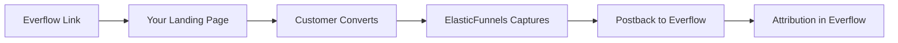

## Overview

The Everflow integration enables outbound conversion tracking to the Everflow affiliate platform. When users click Everflow tracking links and land on your pages, the transaction_id is captured. When conversions occur (from any payment gateway or affiliate network), postbacks are automatically sent to Everflow with conversion data, enabling accurate attribution and split test tracking.

## What This Integration Provides

<CardGroup cols={2}>
  <Card title="Conversion Postbacks" icon="arrow-trend-up">
    Automatically send conversion data to Everflow when purchases occur
  </Card>
  <Card title="Split Test Attribution" icon="chart-line">
    Track which landers and pre-landers generate conversions in Everflow
  </Card>
  <Card title="Flexible Parameters" icon="sliders">
    Configurable parameter builder with all Everflow-supported variables
  </Card>
  <Card title="Smart Detection" icon="sparkles">
    Intelligent click ID detection with fallback support for multiple parameter names
  </Card>
</CardGroup>

## How It Works

### The Flow

1. **User clicks Everflow tracking link** → Everflow generates transaction_id
2. **Everflow redirects to your page** → Appends transaction_id to URL (e.g., `?transaction_id=ABC123` or `?sub1=ABC123`)
3. **ElasticFunnels captures parameters** → Stored in click tracking data
4. **Customer makes purchase** → Via any payment gateway or affiliate network
5. **Postback automatically sent** → Conversion data sent to Everflow with transaction_id for attribution



### What Makes This Unique

Unlike affiliate network integrations that **receive** conversions, Everflow is **outbound only** - we send conversion data to Everflow for attribution, similar to how Google Ads and Meta Ads integrations work.

<Info>
This integration is perfect for affiliates and media buyers who want to track which landers and pre-landers generate the best conversions in Everflow.
</Info>

## Setup Guide

### Step 1: Create Everflow Integration

1. Navigate to **Settings → Integrations → Affiliate Networks**
2. Find **Everflow** and click **"Activate"**
3. You'll see the integration configuration form

### Step 2: Get Your Network ID (nid)

<Warning>
**Required:** You need your Everflow Network ID to send postbacks.
</Warning>

1. Log into your Everflow account
2. Navigate to **Control Center → Configuration**
3. Find your **Network ID (nid)** - it's a number like `1234` or `5678`
4. Copy this ID - you'll need it in the next step

<Info>
The Network ID identifies your Everflow account. Without it, Everflow won't know where to attribute conversions.
</Info>

### Step 3: Configure Postback Settings

1. Enter your **Network ID (nid)** from Step 2
2. Enter your **Postback Domain** (e.g., `tracking.yournetwork.com` or `www.everflow.io`)
3. The postback URL will be automatically generated

**Option A: Use the sample URL (Quick Start)**
- Click **"Insert sample URL"** to populate with default parameters
- The sample includes: nid, transaction_id, order_id, amount, email, currency
- Modify using the parameter builder if needed

**Option B: Edit URL directly**
- The URL field updates automatically as you change Network ID and Domain
- You can also edit it directly and parameters will parse automatically

<Tip>
Most users can start with the sample URL. It includes all the common parameters Everflow needs.
</Tip>

### Step 4: Configure Click ID Parameter

Select which parameter Everflow uses to pass the transaction ID to your pages:

<AccordionGroup>
  <Accordion title="transaction_id (Default - Most Common)">
    Everflow passes the transaction ID directly as `transaction_id` in the URL.
    
    **Example:** `yoursite.com/page?transaction_id=ABC123`
    
    **Use when:** Your Everflow offer is configured with default settings.
  </Accordion>

  <Accordion title="sub1, sub2, sub3, sub4, or sub5">
    Everflow passes the transaction ID via a sub-parameter.
    
    **Example:** `yoursite.com/page?sub1=ABC123` (transaction_id passed in sub1)
    
    **Use when:** Your Everflow offer is configured to pass transaction_id via a specific sub-parameter.
  </Accordion>
</AccordionGroup>

<Info>
**How to check:** Look at a sample tracking link from Everflow. The parameter that contains the long unique ID (like "ABC123") is your transaction_id parameter.
</Info>

### Step 5: Customize Parameters (Optional)

Use the parameter builder to customize what data is sent to Everflow:

1. **Default parameters** are pre-configured (transaction_id, order_id, amount, email, currency, timestamp)
2. **Add custom parameters** by clicking "+ Add Parameter"
3. **Select variables** from the dropdown for each parameter
4. **Remove optional parameters** by clicking the X button

**Available Variables:**

- **Required:** transaction_id, order_id, amount, currency
- **Customer:** email, firstname, lastname, phone, user_ip
- **Location:** geo_country_code, geo_country_name, geo_region_name, geo_city
- **Other:** timestamp, sub1-sub5

<Warning>
**transaction_id is required** and cannot be removed. Everflow needs this to attribute conversions correctly.
</Warning>

### Step 6: Configure Merchant Filtering (Optional)

Choose which merchants should send postbacks to Everflow:

**All Merchants (Default):**
- Postbacks sent for conversions from any payment gateway
- Works with any payment gateway or affiliate network

**Specific Merchants:**
- Click "Specific merchants" radio button
- Click "+ Add Merchant" to select merchants
- Only selected merchants will send postbacks to Everflow

<Info>
Most users leave this set to "All merchants" to track all conversions regardless of payment method.
</Info>

### Step 7: Save and Test

1. Click **"Save Integration"** or **"Update Integration"**
2. Your integration is now active
3. Test by clicking an Everflow tracking link and making a test purchase

## Configuration Options

### Postback URL

The postback URL is a template with macros (like `{transaction_id}`) that get replaced with actual values when sending postbacks.

**Example:**
```
https://tracking.yournetwork.com/?nid=1234&transaction_id={transaction_id}&order_id={order_id}&amount={amount}&email={email}&currency={currency}
```

**When a conversion happens, macros are replaced:**
```
https://tracking.yournetwork.com/?nid=1234&transaction_id=ABC123&order_id=ORD456&amount=99.99&email=customer@example.com&currency=USD
```

<Warning>
The `nid` parameter is **required** - it identifies your Everflow network account. Get this from Control Center → Configuration in Everflow.
</Warning>

### Click ID Parameter

This tells ElasticFunnels which URL parameter contains Everflow's transaction_id:

- Most Everflow offers use `transaction_id` directly
- Some offers pass it via `sub1`, `sub2`, etc.
- ElasticFunnels automatically detects it with intelligent fallback

### Smart Fallback Detection

If the configured parameter isn't found, the system automatically checks:
1. `transaction_id`
2. `sub1` through `sub5`

This ensures conversions are tracked even if configuration doesn't exactly match.

## Parameter Builder

### How to Use

The parameter builder gives you full control over what data is sent:

<Steps>
  <Step title="Add Parameter">
    Click "+ Add Parameter" to add a new field to your postback URL
  </Step>
  
  <Step title="Enter Parameter Name">
    Type the parameter name (e.g., "order_id", "email", "custom_field")
  </Step>
  
  <Step title="Select Variable">
    Choose from the dropdown which data to send (e.g., {order_id}, {email}, {amount})
  </Step>
  
  <Step title="View Generated URL">
    The URL field updates automatically as you add/remove parameters
  </Step>
</Steps>

### Two-Way Sync

The URL and parameter builder stay in sync:

- **Edit URL directly** → Parameters automatically parse and display in builder
- **Change parameters** → URL automatically updates
- **Best of both worlds** → Use whichever method is easier for you

## Available Variables

### Required Variables

<ParamField path="nid" type="string" required>
  Network ID - Your Everflow account identifier. Find in Control Center → Configuration. **Required to identify your account.**
</ParamField>

<ParamField path="transaction_id" type="string" required>
  Everflow click ID captured from the tracking URL. **Required for attribution.**
</ParamField>

<ParamField path="order_id" type="string" required>
  Your order/conversion ID from ElasticFunnels
</ParamField>

<ParamField path="amount" type="number" required>
  Conversion amount (formatted as decimal, e.g., 99.99)
</ParamField>

<ParamField path="currency" type="string" required>
  Currency code (e.g., USD, GBP, EUR)
</ParamField>

### Customer Information

<ParamField path="email" type="string">
  Customer email address (used for Everflow Email Address Attribution)
</ParamField>

<ParamField path="firstname" type="string">
  Customer first name
</ParamField>

<ParamField path="lastname" type="string">
  Customer last name
</ParamField>

<ParamField path="phone" type="string">
  Customer phone number
</ParamField>

<ParamField path="user_ip" type="string">
  Customer IP address
</ParamField>

### Location Data

<ParamField path="geo_country_code" type="string">
  Two-letter country code (ISO 3166-1 alpha-2)
</ParamField>

<ParamField path="geo_country_name" type="string">
  Full country name
</ParamField>

<ParamField path="geo_region_name" type="string">
  State/region name
</ParamField>

<ParamField path="geo_city" type="string">
  City name
</ParamField>

### Other Parameters

<ParamField path="timestamp" type="number">
  UNIX timestamp of the conversion (overrides Everflow's timestamp)
</ParamField>

<ParamField path="sub1" type="string">
  Sub-parameter 1 from the original click (if available)
</ParamField>

<ParamField path="sub2" type="string">
  Sub-parameter 2 from the original click (if available)
</ParamField>

<ParamField path="sub3" type="string">
  Sub-parameter 3 from the original click (if available)
</ParamField>

<ParamField path="sub4" type="string">
  Sub-parameter 4 from the original click (if available)
</ParamField>

<ParamField path="sub5" type="string">
  Sub-parameter 5 from the original click (if available)
</ParamField>

## Split Test Tracking

### Why This Matters

If you're running split tests of different landers or pre-landers, Everflow needs to know which variation generated each conversion.

### How It Works

1. **Create split test** in ElasticFunnels (different landing pages)
2. **Use Everflow tracking links** for each variation
3. **Everflow tracks** which link was clicked
4. **Conversions attributed** automatically when postbacks are sent
5. **View results** in Everflow dashboard showing which lander performed best

<Check>
ElasticFunnels automatically sends the transaction_id back to Everflow, so attribution happens automatically - no manual tracking needed!
</Check>

## Use Cases

### For Affiliates

Track your promotional performance:
- Which landers convert best
- Split test different pre-landers
- Accurate commission tracking
- Multi-offer campaigns

### For Direct Response Supplement Brands

Track your affiliate network performance:
- Monitor affiliate-driven conversions
- Attribution for different traffic sources
- Split test offer pages
- Campaign optimization data

### For Media Buyers

Optimize your paid traffic:
- Test different landing pages
- Track conversion rates by lander
- Optimize based on actual conversions
- Scale winning variations

## Troubleshooting

<AccordionGroup>
  <Accordion title="No Postbacks Being Sent">
    **Possible Causes:**
    - No transaction_id in the click data (not from Everflow link)
    - Integration not enabled
    - Postback URL configuration issue
    
    **Solution:**
    1. Verify customer clicked an Everflow tracking link before purchasing
    2. Check integration is enabled in settings
    3. Verify postback URL format is correct
    4. Check logs for error messages
  </Accordion>

  <Accordion title="Transaction ID Not Found">
    **Issue:** Postbacks not sending because transaction_id isn't detected
    
    **Solution:**
    1. Check which parameter Everflow uses to pass transaction_id (look at a sample tracking link)
    2. Update "Click ID Parameter" dropdown to match
    3. Common options: transaction_id, sub1, sub2
    4. System automatically checks fallbacks if not found
  </Accordion>

  <Accordion title="Conversions Not Showing in Everflow">
    **Possible Causes:**
    - Postback URL incorrect
    - Transaction_id not being passed correctly
    - Network timeout or connectivity issue
    
    **Solution:**
    1. Verify postback URL matches your Everflow configuration
    2. Check Everflow dashboard for incoming postback logs
    3. Test with a small purchase to verify tracking
    4. Review ElasticFunnels logs for postback attempts
  </Accordion>

  <Accordion title="Some Parameters Not Appearing">
    **Issue:** Some variables showing as empty in Everflow
    
    **Explanation:** This is normal - not all fields are always available:
    - Email, phone, and other customer data depends on what was collected
    - Location data depends on what was tracked during the click
    - Sub-parameters only included if they were in the original tracking URL
    
    **Solution:** Optional parameters are sent only when available. Everflow handles missing parameters gracefully.
  </Accordion>
</AccordionGroup>

## Best Practices

<Steps>
  <Step title="Start with Sample URL">
    Use the "Insert sample URL" button to get started quickly with recommended parameters.
  </Step>
  
  <Step title="Verify Click ID Parameter">
    Check a sample Everflow tracking link to confirm which parameter contains the transaction_id (usually "transaction_id" or "sub1").
  </Step>
  
  <Step title="Test with Small Purchase">
    Test the integration with a small purchase first to verify postbacks are being received by Everflow.
  </Step>
  
  <Step title="Monitor Everflow Dashboard">
    Check your Everflow dashboard to confirm conversions are being attributed correctly to your tracking links.
  </Step>
  
  <Step title="Use Email Parameter">
    Include the email parameter if your Everflow account supports Email Address Attribution for better tracking.
  </Step>
</Steps>

## Advanced Configuration

### Custom Parameters

You can add any custom parameters Everflow supports:

1. Click **"+ Add Parameter"** in the parameter builder
2. Enter the parameter name
3. Select a variable from the dropdown or enter a custom value
4. The URL updates automatically

### Sub-Parameters

If your original Everflow tracking link included sub-parameters (sub1, sub2, etc.), they're automatically passed through in the postback if you include them in your parameter configuration.

<Tip>
Sub-parameters are useful for tracking traffic source, campaign, creative, or other custom identifiers through the entire conversion flow.
</Tip>

## Security & Privacy

### Data Handling

- **Transaction ID:** Unique identifier from Everflow (not sensitive)
- **Customer Data:** Only sent if configured (email, name, phone are optional)
- **Hashed Data:** All data is URL-encoded before transmission
- **HTTPS Only:** All postbacks use secure HTTPS connections

### Privacy Considerations

Some Everflow accounts disable PII (Personally Identifiable Information). You can:
- Disable email parameter if needed
- Disable name and phone parameters
- Still track conversions with just order ID and amount

<Info>
The integration respects your privacy settings. Optional parameters are only sent if configured.
</Info>

## Integration Type

<Note>
**Important:** Everflow is an **outbound integration** - we send data TO Everflow, we don't receive data FROM Everflow. This is the same pattern as Google Ads and Meta Ads conversion tracking.
</Note>

### What This Means

- **No incoming postbacks** - Everflow doesn't send data to us
- **Triggered by conversions** - Postbacks fire when purchases occur in ElasticFunnels
- **Attribution only** - Used to tell Everflow which tracking links generated conversions
- **Works with any merchant** - Compatible with any payment gateway or affiliate network

## Frequently Asked Questions

<AccordionGroup>
  <Accordion title="Which parameter should I choose for Click ID Parameter?">
    **Answer:** Look at a sample Everflow tracking link. The parameter containing the long unique ID is your transaction_id parameter. 
    
    - Most offers use `transaction_id` directly
    - Some offers pass it via `sub1` (check your Everflow offer settings)
    - The system automatically checks fallbacks if the configured parameter isn't found
  </Accordion>

  <Accordion title="Can I use Everflow with my payment processor?">
    **Answer:** Yes! Everflow tracks attribution (which lander generated the conversion), while your payment gateway handles the actual payment processing. They work together perfectly:
    
    1. Customer clicks Everflow link (transaction_id captured)
    2. Customer lands on your page
    3. Customer purchases via your payment gateway
    4. ElasticFunnels sends postback to Everflow with transaction_id
    5. Everflow attributes the conversion to the original tracking link
  </Accordion>

  <Accordion title="How do I track split tests with Everflow?">
    **Answer:** 
    1. Create different landing pages in ElasticFunnels
    2. Use Everflow tracking links for each variation
    3. Everflow automatically tracks which link was clicked
    4. When conversions happen, postbacks are sent with the transaction_id
    5. View results in Everflow showing which lander performed best
  </Accordion>

  <Accordion title="What's the difference between Whitelist and Blacklist?">
    **Answer:**
    - **Whitelist** - Only send postbacks for specific affiliate IDs (e.g., only your top 5 affiliates)
    - **Blacklist** - Block specific affiliate IDs from sending postbacks (e.g., exclude fraudulent affiliates)
    - **All affiliates** - Send postbacks for everyone (default)
    
    Affiliate IDs come from your payment gateway and identify which affiliate generated the sale.
  </Accordion>

  <Accordion title="Can I filter by both Merchants and Affiliates?">
    **Answer:** Yes! You can combine filters:
    - Merchant filter: Only specific payment gateways
    - Affiliate whitelist: Only specific affiliate IDs
    - Result: Very targeted tracking (e.g., only BuyGoods conversions from affiliate 12345)
  </Accordion>

  <Accordion title="What if I don't see transaction_id in my URL?">
    **Answer:** Everflow might be passing the transaction_id via a sub-parameter (like sub1). Check your Everflow offer configuration or contact your affiliate manager to find out which parameter is used.
  </Accordion>

  <Accordion title="How long until conversions appear in Everflow?">
    **Answer:** Postbacks are sent immediately when conversions are created (within seconds). Everflow should show the conversion in real-time or within a few minutes.
  </Accordion>

  <Accordion title="Can I test the integration before going live?">
    **Answer:** Yes! 
    1. Click an Everflow test tracking link
    2. Make a small test purchase
    3. Check Everflow dashboard to verify the conversion was received
    4. Review ElasticFunnels logs to confirm postback was sent
  </Accordion>

  <Accordion title="What if postbacks fail?">
    **Answer:** The system handles failures gracefully:
    - Failed postbacks are logged for debugging
    - Conversion is still created in ElasticFunnels
    - You can retry by checking the logs and contacting support if needed
    - Postbacks are sent via queue, so temporary network issues are handled automatically
  </Accordion>
</AccordionGroup>

## URL Editing

### Direct URL Editing

You can edit the postback URL directly in the text field:

```
https://api.everflow.io/v1/postback?transaction_id={transaction_id}&order_id={order_id}&amount={amount}
```

The parameter builder will automatically update to show the parsed parameters.

### Parameter Builder

Or use the visual parameter builder:
- Add/remove parameters visually
- Select variables from organized dropdown
- See immediate URL preview
- Required parameters protected from removal

<Tip>
Both methods work equally well. Use whichever is more comfortable for you - they stay perfectly in sync!
</Tip>

## Technical Details

### Postback Method

Postbacks are sent via **HTTP GET requests** (not POST), which is the standard for Everflow and most affiliate networks.

### Error Handling

The integration includes comprehensive error handling:
- Failed postbacks are logged but don't break conversion creation
- Network timeouts are handled gracefully
- Invalid URLs are caught and logged
- System continues to work even if Everflow is temporarily unavailable

### Queue Processing

Postbacks are processed asynchronously via Laravel's queue system:
- Doesn't slow down conversion creation
- Automatic retry on temporary failures
- Can be monitored via queue logs

<Info>
Async processing ensures that even if Everflow is temporarily slow or unavailable, your conversions are still created normally in ElasticFunnels.
</Info>

## Compatibility

### Works With Any Payment Gateway

The Everflow integration works regardless of which payment gateway you use. Everflow tracks attribution (which link/lander generated the conversion), independent of how payment is processed - whether you're using an affiliate network, credit card processor, or any other payment method.

### Works With Split Tests

Compatible with ElasticFunnels' built-in split testing:
- Split test landing pages
- Split test pre-landers
- A/B test offers
- Everflow receives attribution for all variations

## Next Steps

<CardGroup cols={2}>
  <Card
    title="Affiliate Tracking"
    icon="chart-line"
    href="/integrations/affiliate-tracking"
  >
    Learn about affiliate tracking and attribution
  </Card>
  <Card
    title="Analytics Dashboard"
    icon="chart-mixed"
    href="/analytics/overview"
  >
    View your conversion and performance data
  </Card>
  <Card
    title="Split Test Analytics"
    icon="chart-bar"
    href="/analytics/split-test"
  >
    Analyze your split test performance
  </Card>
  <Card
    title="Conversion Tracking"
    icon="bullseye-arrow"
    href="/analytics/conversions"
  >
    Deep dive into your conversion data
  </Card>
</CardGroup>
