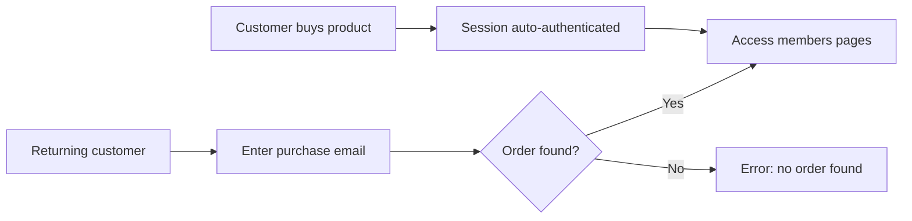

A Members Area lets your customers log in with their purchase email and access their orders, digital downloads, bonuses, and account information — no password required.

## How It Works

ElasticFunnels uses an email-based login system tied to purchase records. There are two ways a customer gets access:

1. **Automatic login after purchase** — When a customer completes checkout, their session is immediately authenticated. They can navigate to any members-only page without additional login.
2. **Email-based login** — Returning customers enter their purchase email on a login page. The system looks up their orders and grants access if a match is found.



## Key Components

A members area typically has three pages:

| Page | Purpose | Login required? |
|------|---------|----------------|
| **Members Login** | Email form where returning customers identify themselves | No |
| **Members Dashboard** | Main content area with products, bonuses, order history | Yes |
| **Thank You** | Post-purchase confirmation with order details and members area link | No (auto-authenticated) |

<CardGroup cols={2}>
  <Card title="Members Login" icon="lock" href="/members-area/login">
    Set up the email-based login form and configure redirects
  </Card>
  <Card title="Showing Order Details" icon="receipt" href="/members-area/order-details">
    Display order history, products, tracking, and shipping info
  </Card>
</CardGroup>

## Auto-Login After Purchase

When a customer completes a purchase through ElasticFunnels checkout, the system automatically:

1. Sets `is_customer = true` on their session
2. Stores their email, name, billing/shipping addresses, and order IDs in the session
3. Marks them as an authenticated customer

This means **thank-you pages and members pages work immediately** after checkout — the customer never needs to enter their email again during that browser session.

The session stores the following customer data automatically:

| Field | Description |
|-------|-------------|
| `customer.name` | Full name from checkout |
| `customer.email` | Email address |
| `customer.first_name` | First name |
| `customer.last_name` | Last name |
| `customer.phone` | Phone number (if collected) |
| `customer.order_id` | Most recent order ID |
| `customer.order_ids` | All order IDs for this customer |
| `customer.billing_*` | Billing address fields |
| `customer.shipping_*` | Shipping address fields |

## Protecting Pages with Login

Any page can be set to require login. When a visitor without a valid session tries to access a protected page:

- If a **redirect URL** is configured (e.g., `/members-login`), they are redirected there
- If no redirect is configured, a 404 page is shown

To set up a protected page:

1. Open the page settings in the editor
2. Enable **Requires Login**
3. Set the **Redirect URL** to your login page (e.g., `/members-login`)

When a customer has a valid session (either from a purchase or from the login form), they can access the protected page normally.

## Template Variables

Inside members-only pages, you can use the `customer` object to personalize content:

```html
<h1>Welcome, {{ customer.first_name|default:"Member" }}!</h1>
<p>Your account email: {{ customer.email }}</p>
<p>Order ID: {{ customer.order_id }}</p>
```

See [Showing Order Details](/members-area/order-details) for how to display full order history with products and tracking.
