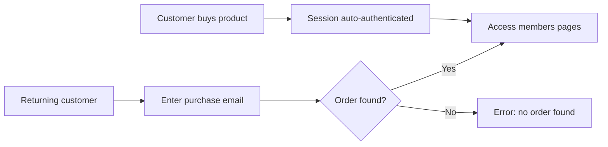

A Members Area lets your customers log in with their purchase email and access their orders, digital downloads, bonuses, and account information — no password required.

## How It Works

ElasticFunnels uses an email-based login system tied to purchase records. There are two ways a customer gets access:

1. **Automatic login after purchase** — When a customer completes checkout, their session is immediately authenticated. They can navigate to any members-only page without additional login.
2. **Email-based login** — Returning customers enter their purchase email on a login page. The system looks up their orders and grants access if a match is found.



## Key Components

A members area typically has three pages:

| Page | Purpose | Login required? |
|------|---------|----------------|
| **Members Login** | Email form where returning customers identify themselves | No |
| **Members Dashboard** | Main content area with products, bonuses, order history | Yes |
| **Thank You** | Post-purchase confirmation with order details and members area link | No (auto-authenticated) |

<CardGroup cols={2}>
  <Card title="Members Login" icon="lock" href="/members-area/login">
    Set up the email-based login form and configure redirects
  </Card>
  <Card title="Showing Order Details" icon="receipt" href="/members-area/order-details">
    Display order history, products, tracking, and shipping info
  </Card>
</CardGroup>

## Auto-Login After Purchase

When a customer completes a purchase through ElasticFunnels checkout, the system automatically:

1. Sets `is_customer = true` on their session
2. Stores their email, name, billing/shipping addresses, and order IDs in the session
3. Marks them as an authenticated customer

This means **thank-you pages and members pages work immediately** after checkout — the customer never needs to enter their email again during that browser session.

The session stores the following customer data automatically:

| Field | Description |
|-------|-------------|
| `customer.name` | Full name from checkout |
| `customer.email` | Email address |
| `customer.first_name` | First name |
| `customer.last_name` | Last name |
| `customer.phone` | Phone number (if collected) |
| `customer.order_id` | Most recent order ID |
| `customer.order_ids` | All order IDs for this customer |
| `customer.billing_*` | Billing address fields |
| `customer.shipping_*` | Shipping address fields |

## Protecting Pages with Login

There are two ways to restrict a page to logged-in customers only.

### Option 1: Page setting (recommended)

1. Open the page settings in the editor
2. Enable **Requires Login**
3. Set the **Redirect URL** to your login page (e.g., `/members-login`)

When a visitor without a valid session tries to access the page they are automatically redirected to that URL. If no redirect is configured, a 404 page is shown.

### Option 2: Backend scope script

Add a `<script scope="backend">` block at the top of the page. This gives you more control — for example, redirecting to different pages based on the customer's order history or preserving a `?next=` query parameter.

```html
<script scope="backend">
  if (!is_customer) {
    redirect('/members-login');
  }
</script>
```

You can pass the current path as a query parameter so the login page can redirect back after a successful login:

```html
<script scope="backend">
  if (!is_customer) {
    redirect('/members-login?next=' + encodeURIComponent(request.path));
  }
</script>
```

`is_customer` is `true` when the visitor has an active session from a purchase or from the email login form. See [Request Context](/backend-scripts/context) for all available globals and [Actions](/backend-scripts/actions) for the full `redirect()` reference.

When a customer has a valid session (either from a purchase or from the login form), the script does nothing and the page renders normally.

## Auth Wrapper Pattern (recommended)

When your members area has more than one page — dashboard, order history, bonuses, course access, account settings — the recommended approach is an **auth wrapper**: a shared layout or script block that handles the authentication check and loads common data in one place. Every members page extends or includes the wrapper, so you never repeat the login redirect logic.

### For `.ef` template files — `@extends`

Create a `members-layout.ef` that handles auth and prefetches common data:

```html
{{-- members-layout.ef --}}
<script scope="backend">
  if (!is_customer) {
    redirect('/members-login');
  }
  var orders = getOrders('newest', 20);
  var bonuses = getBonusProducts();
  setVariable('orders', orders);
  setVariable('bonuses', bonuses);
</script>
<!DOCTYPE html>
<html lang="en">
<head>
  <meta charset="UTF-8" />
  <title>@block("title") Members Area @endblock</title>
</head>
<body>
  <header>
    <span>Welcome, {{ customer.first_name | default:"Member" }}</span>
    <nav>
      <a href="/members">Dashboard</a>
      <a href="/members/orders">Orders</a>
      <a href="/members/bonuses">Bonuses</a>
    </nav>
  </header>
  @block("content") @endblock
</body>
</html>
```

Every members page extends it — no auth logic needed per page:

```html
{{-- members-dashboard.ef --}}
@extends("members-layout")
@block("title") Dashboard @endblock
@block("content")
<h1>Your Orders</h1>
@foreach(order in orders)
  <p>#{{ order.order_number }} — {{ order.created_at | date:'dd MMM yyyy' }}</p>
@endforeach
@endblock
```

```html
{{-- members-bonuses.ef --}}
@extends("members-layout")
@block("title") Bonuses @endblock
@block("content")
<script scope="backend">
  var bonuses = getBonusProducts();
  setVariable('bonuses', bonuses);
</script>
<h1>Your Bonuses</h1>
@if(var.bonuses.length > 0)
  @foreach(bonus in var.bonuses)
    <div class="bonus-card">
      
      <h3>{{ bonus.title }}</h3>
      <p>{{ bonus.description }}</p>
      @if(bonus.bonus_url)
        <a href="{{ bonus.bonus_url }}">Download</a>
      @endif
    </div>
  @endforeach
@else
  <p>No bonus products yet.</p>
@endif
@endblock
```

### For page builder pages — shared script block

Paste the same backend script at the top of every protected page. Because it always does the same work, any change only needs to happen in one shared spot (consider using a page component for the header/nav):

```html
<script scope="backend">
  if (!is_customer) {
    redirect('/members-login');
  }
  var orders = getOrders('newest', 20);
  setVariable('orders', orders);
</script>

<h1>Welcome, {{ customer.first_name | default:"Member" }}</h1>
```

<Tip>
Load only what each page needs. The dashboard might call `getOrders('newest', 5)`, while the full order-history page calls `getOrders('newest', 100)`. The wrapper sets a sensible default; individual pages can override `orders` by calling `setVariable` again after the wrapper runs.
</Tip>

## Template Variables

Inside members-only pages, you can use the `customer` object to personalize content:

```html
<h1>Welcome, {{ customer.first_name|default:"Member" }}!</h1>
<p>Your account email: {{ customer.email }}</p>
<p>Order ID: {{ customer.order_id }}</p>
```

See [Showing Order Details](/members-area/order-details) for how to display full order history with products and tracking.
