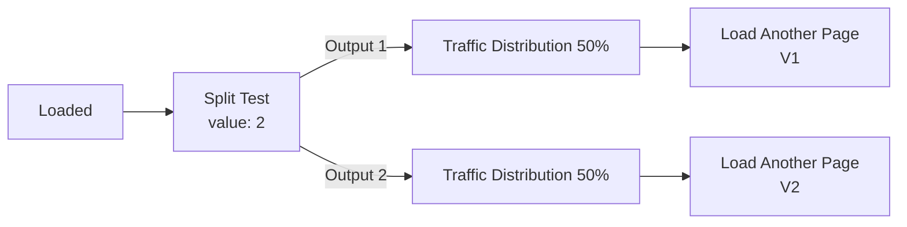

{/* SCREENSHOT: Page variants panel or page settings · list of V1 V2 variants and active badge · desktop */}

Page variants let you run multiple versions of the same page for split tests, fresh angles, or different campaigns.

## Creating Page Variants

### Add a New Variant
1. Go to **Pages** → Select your page
2. Click **"Add Variant"** or **"Create Variant"**
3. The system automatically creates a new variant with the next number (V1, V2, V3, etc.)
4. Edit the new variant with your desired changes

### Variant Naming System
ElasticFunnels uses a **numerical system** instead of letters:
- **V1** - First variant (original)
- **V2** - Second variant  
- **V3** - Third variant
- And so on...

**Why numbers instead of letters?**
- **Clearer progression** - Easy to understand the sequence
- **No confusion** - No ambiguity about which comes first
- **Unlimited variants** - Can create as many as needed (V1, V2, V3...V100)

## Managing Variants

### Set Active Variant
1. **Select the variant** you want to make active
2. **Click "Set as Active"** or toggle the active status
3. **The active version changes** for the page
4. **Variant slugs** can be used when you need a separate URL for a specific variant

### Variant URLs
- The primary variant uses the page's normal URL, for example `https://yoursite.com/page`.
- Additional variants are separate page records and can have their own `variant_slug`.
- If a variant slug is configured, it can be served as its own URL, for example `https://yoursite.com/page-v2`.
- Funnel and Page Events variant nodes can also route traffic to a variant directly.

### Variant Status
Each variant has a status:
- **Active** - Currently serving to visitors
- **Draft** - Work in progress, not live
- **Paused** - Temporarily disabled
- **Archived** - Saved for reference but not active

## Serving a variant from Page Events

The **Load Another Page** node (`page_variant`) renders another page's content **at the current URL** — no redirect, no URL change. It is how a variant gets served without giving it its own address.

| Field | Description |
|-------|-------------|
| **Page** | The variant to load. Stored as `value`; the slug is filled in automatically. |
| **Load & Override Page Events** | Off by default — the variant inherits the primary page's event graph. Turn it on to give the variant its own events. |

<Warning>
**Load & Override Page Events re-runs the whole event pass** for the newly loaded page. That is capped at three reloads per request, so avoid chains where each variant loads another variant that also overrides its events.
</Warning>

The node is skipped in preview mode, so previewing a page always shows the page itself.

## Split Testing with Variants

### Page-level split testing

To split traffic between variants at one URL:

1. **Create the variants** with different content.
2. In **Page Events**, add a **Split Test** node and set **Total Variants**.
3. A **Traffic Distribution** node is created per output — set the percentages.
4. Under each Traffic Distribution node, attach a **Load Another Page** pointing at that variant.
5. Save. The split-test record is created and the node gains a **View Results** link.

<Note>
Testing **one section** of a page rather than the whole page? Use a component split test instead — it is cheaper to build and easier to read. See [Split Testing](/funnels/split-testing#which-kind-of-test-do-i-want).
</Note>

### Funnel-level integration
Variants work with funnel split testing:
- **Split test node** can direct traffic to different variants
- **Purchase tracking** attributes conversions to specific variants
- **Analytics** show performance data for each variant

## Best Practices

### Variant Organization
- **Clear naming** - Use descriptive names beyond just V1, V2, V3
- **Version notes** - Document what changed in each variant
- **Purpose tracking** - Record why each variant was created
- **Performance baseline** - Always keep your original as a control

### Testing Strategy
- **Test one element** at a time for clear results
- **Significant changes** - Make meaningful differences between variants
- **Statistical significance** - Run tests long enough for reliable data
- **Document results** - Keep notes on what worked and what didn't

### Content Management
- **Consistent structure** - Keep similar layouts when possible
- **Asset management** - Organize images and videos for each variant
- **Mobile optimization** - Ensure all variants work on mobile devices
- **Loading speed** - Optimize each variant for fast loading

## Advanced Variant Usage

### Campaign-Specific Variants
Create variants for different marketing campaigns:
- **Traffic source optimization** - Different versions for different sources
- **Seasonal campaigns** - Holiday or event-specific versions
- **Geographic targeting** - Location-specific content
- **Device optimization** - Mobile vs desktop optimized versions

### Personalization
Use variants for personalized experiences:
- **Affiliate-specific** - Different versions for different affiliates
- **User segment** - Different content for different user types
- **Purchase history** - Different offers based on past purchases
- **Behavior-based** - Different content based on user actions

## URLs and Routing

### Reaching a specific variant

There are two ways, and **no `v=` query parameter**:

- **By its own slug** — the active variant answers on the page's `slug`; every other variant answers on its `variant_slug` (for example `page-v2`). A variant without a `variant_slug` has no URL of its own.
- **By a Load Another Page node** — the variant renders at the primary page's URL, with nothing in the address bar to reveal it. This is what you want for split tests.

**SEO considerations** — use canonical tags when several slugs serve near-identical content.

### Page Events Integration
Variants work with Page Events:
- **Load Another Page** - Serve a variant at the primary URL
- **Query parameter conditions** - Route to a variant based on the incoming URL
- **Dynamic content** - Swap sections rather than the whole page
- **Conditional logic** - Different actions for different variants

### Funnel Integration
Variants integrate with funnel flows:
- **Split test routing** - Direct traffic to specific variants
- **Purchase attribution** - Track which variant drove the conversion
- **Upsell sequences** - Different upsells based on variant performance

## Analytics and Reporting

### Performance Metrics
Track key metrics for each variant:
- **Conversion rate** - Percentage of visitors who convert
- **Revenue per visitor** - Average revenue generated
- **Bounce rate** - Percentage who leave immediately
- **Time on page** - How long visitors stay
- **Click-through rate** - Engagement with call-to-action buttons

### Comparison Tools
- **Side-by-side comparison** - Compare variant performance
- **Statistical significance** - Determine if differences are meaningful
- **Confidence intervals** - Understand the reliability of results
- **Performance trends** - Track improvement over time

## Troubleshooting

### Common Issues
- **Variants not loading** - Check the variant's `variant_slug`, or that a **Load Another Page** node is on the branch being taken. A condition on its own only picks a path — it does not load a page.
- **Preview always shows the primary page** - Expected: **Load Another Page** is skipped in preview mode.
- **Split tests not working** - Verify funnel or page event configuration
- **Analytics not tracking** - Ensure proper tracking setup for variants
- **Content not updating** - Clear cache and check variant status

### Testing Your Variants
1. **Direct URL access** - Test each variant URL directly
2. **Split test functionality** - Verify random distribution works
3. **Mobile testing** - Check all variants on mobile devices
4. **Cross-browser testing** - Ensure compatibility across browsers
5. **Performance testing** - Check loading speed for each variant

<Note>
Use variants for meaningful tests only. Too many small variants make results harder to read.
</Note> 